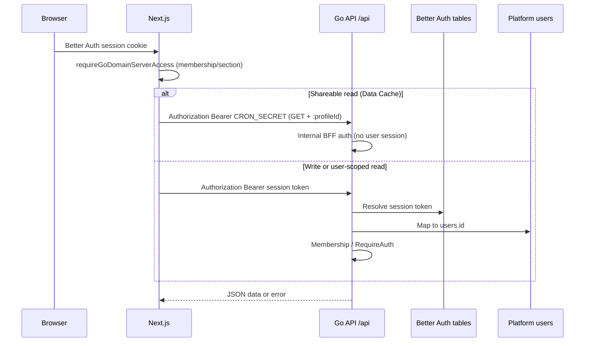

API auth is based on the **Better Auth session Bearer** (the Next BFF forwards it) for product routes and writes. `/api/internal/*` routes and **cacheable product reads** from the BFF use a **shared secret** (`CRON_SECRET`) server-to-server. Public Metronome and QStash callbacks do not use Bearer: they validate their signature over the exact bytes before processing the event.



## Layers

| Layer | Mechanism | Who validates it | Typical failure |
| --- | --- | --- | --- |
| **User** | `Authorization: Bearer <session token>` | `ResolvePlatformIdentity` + `RequireUserAuth` / `RequireAuth` | `401 authentication required` / invalid session |
| **BFF internal read** | `Authorization: Bearer <CRON_SECRET>` on **GET/HEAD** with `:profileId` | `ResolvePlatformIdentity` (constant-time secret) | `401` (non-safe method, no profile, invalid secret) |
| **Profile** | Path `:profileId` + membership (session) **or** membership already asserted in Next (internal) | Session: middleware; Internal: BFF before cache | `403` profile access denied |
| **Section** | member `section_access` (session) **or** `requireGoDomainServerAccess(ws, section)` in Next (internal) | Session: middleware; Internal: BFF | `403` section access denied |

There are no `X-Agata-*` identity headers. With a session, the user comes only from the token; the profile comes only from the path. With internal BFF, **there is no user id** in Go: `assignedToMe` / `createdByMe` filters require a session.

### Better Auth session

```http
Authorization: Bearer <session.token>
```

Go resolves the token against the Better Auth `session` table and links it to `users` via `auth_user_id`.

#### Mirror Better Auth → `users`

1. On `user.create`, the BFF calls `POST /api/internal/users/bootstrap` with `Authorization: Bearer <CRON_SECRET>` (body with `authUserId`). Without the secret → `401`.
2. If the mirror is still missing, `GET /users/me` returns `401` and Next calls `POST /users/me/bootstrap` with the Better Auth **session** Bearer.
3. Authenticated user bootstrap (`/users/me/bootstrap`) requires a valid session token (a loose auth-user header is no longer accepted).

### Profile in the URL

```http
GET /api/tasks/profiles/{profileId}
POST /api/finance/profiles/{profileId}/transactions
```

When the route includes `:profileId`, the middleware checks membership and `section_access`. The profile is not sent as a header.

## Which middleware applies

```txt
/api/health*                    → public
/api/webhooks/metronome         → Metronome HMAC signature
/api/qstash/*                   → Upstash-Signature JWT + body hash
/api/internal/...               → CronAuth (Bearer CRON_SECRET)
everything else under /api/*
  → ResolvePlatformIdentity
       · Session Bearer → user + membership + section
       · Bearer CRON_SECRET → GET/HEAD only + :profileId (BFF cached reads)
  → per group: RequireUserAuth() or RequireAuth()
```

| Group | Extra middleware | Example |
| --- | --- | --- |
| `/webhooks/metronome` | `Date` signature + HMAC SHA-256 | Idempotent balance/contract notifications |
| `/qstash/*` | HS256 JWT `Upstash-Signature`, exact subject, and SHA-256 hash | Idempotent dispatch and failure callback |
| `/internal/*` | `CronAuth` | crons, bootstrap, Stripe sync, and QStash recovery |
| `/users/*` | `RequireUserAuth` | `GET /users/me` |
| `/profiles/*` | `RequireUserAuth` (+ internal OK if `:profileId` is present) | members, usage, and Agent credit reservations |
| `/{domain}/profiles/:id/*` | `RequireAuth` (user+profile+section **or** internal BFF) | tasks, finance, notebook… |

Reserving, confirming, and releasing Agent credits requires a session and
profile membership. The hourly job
`POST /internal/qstash/recover` and the operational
dispatch/reconciliation endpoints require `CRON_SECRET`. The callbacks
`POST /qstash/notifications/dispatch`, `POST /qstash/metronome/dispatch`, and
`POST /qstash/failure` are registered before platform identity and only
accept a valid QStash signature.

### curl — internal (CRON_SECRET)

```bash
curl -sS -X POST http://localhost:8080/api/internal/users/bootstrap \
  -H "Authorization: Bearer $CRON_SECRET" \
  -H "Content-Type: application/json" \
  -d '{"authUserId":"..."}'
```

## Examples

### curl — health (no auth)

```bash
curl -i http://localhost:8080/api/health
```

### curl — current user

```bash
curl -sS http://localhost:8080/api/users/me \
  -H "Authorization: Bearer $SESSION"
```

### TypeScript — BFF

```ts
const headers = {
  'Content-Type': 'application/json',
  Authorization: `Bearer ${sessionToken}`,
};

const res = await fetch(`${goBaseUrl}/api/tasks/profiles/${profileId}`, {
  method: 'POST',
  headers,
  body: JSON.stringify(payload),
});
```
