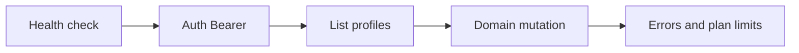

The **Agata HTTP API** is the contract between the Next.js app (`apps/app`) and the Go backend (`apps/api`). It is designed for **internal monorepo use** (server actions, route handlers, jobs), not as a third-party public API yet — but it is documented with the same rigor as a product API.

<Tip>
  **Goal of this tab:** shorten time-to-first-call, and give humans and LLMs copy-paste examples that work.
</Tip>

## Developer journey

| Step | What to do | Where |
| --- | --- | --- |
| 1 | Start the API and hit `/api/health` | [Quickstart](/api/quickstart) |
| 2 | Understand Bearer session and profile in the URL | [Authentication](/api/authentication) |
| 3 | Response envelope, IDs, dates, money | [Conventions](/api/conventions) |
| 4 | Follow a real-world guide | [Guides](/api/guides/create-a-task) |
| 5 | Explore generated endpoints | [OpenAPI](/api/openapi) |
| 6 | Map error codes | [Errors](/api/errors) |

## In this tab

<CardGroup cols={2}>
  <Card title="Quickstart" icon="rocket" href="/api/quickstart">
    First call in under 5 minutes.
  </Card>
  <Card title="Authentication" icon="lock" href="/api/authentication">
    Bearer session and profile in the path.
  </Card>
  <Card title="Guides" icon="book-open" href="/api/guides/create-a-task">
    Create a task, log an expense, edit rich text.
  </Card>
  <Card title="Errors" icon="triangle-exclamation" href="/api/errors">
    Codes, JSON body, and what the client should do.
  </Card>
  <Card title="Domain map" icon="map" href="/api/reference/overview">
    Prefixes and endpoints by product area.
  </Card>
  <Card title="Interactive OpenAPI" icon="code" href="/api/openapi">
    Full spec + Docs7 playground.
  </Card>
</CardGroup>

## Base URL

| Environment | Base |
| --- | --- |
| Local | `http://localhost:8080/api` |
| Configurable | `{scheme}://{host}/api` |

All product routes live under the **`/api`** prefix.

## Who calls the API

| Actor | How they authenticate | Notes |
| --- | --- | --- |
| Next server actions | Internal secret + session identity | Primary path |
| Route handlers / jobs | Secret + user/profile headers | |
| Internal cron | Cron secret | `/internal/...` routes |
| Webhooks (billing) | Provider signature | Outside the typical product path |

## Design principles (DX)

Inspired by API docs that convert developers (Stripe, Resend, and similar):

1. **Guides + reference** — not just a list of endpoints.
2. **Copy-paste examples** — `curl` and TypeScript snippets from the monorepo.
3. **Actionable errors** — stable code + `request_id` + plan limits.
4. **Dual source of truth** — behavior in Go handlers; contract in OpenAPI; narrative on these pages.
5. **LLM-readable** — clear titles, tables, real examples.

## Code in the monorepo

| Piece | Path |
| --- | --- |
| Route registry | `apps/api/internal/delivery/http/handler.go` |
| Auth middleware | `apps/api/internal/delivery/http/middleware/auth.go` |
| JSON envelope | `apps/api/internal/delivery/http/dto/response.go` |
| Canonical spec | `apps/api/docs/openapi.yaml` |
| Copy for Docs7 | `apps/docs/openapi/agata-v1.yaml` |
| TS client | `apps/app/services/<domain>/` |
