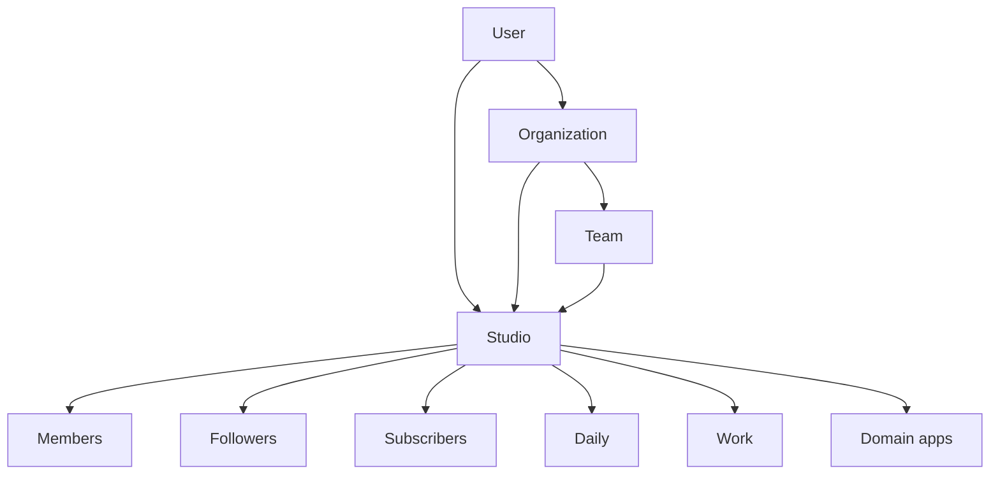

Agata is not a single screen: it is a **studio** with several
apps that share identity, membership, and shell. Selected rows can be
followed without becoming a member.

## Layers

| Layer | What it decides |
| --- | --- |
| **User** | Login, preferences, locale. May belong to Organizations. |
| **Organization** | Owns people, Teams, and zero or more Studios. Not public, not followable. |
| **Team** | Org-scoped membership shortcut. Never an owner. No followers. |
| **Studio** | Public actor (`handle`). Person-owned or Organization-owned. Table `profiles`. API `studioId`. |
| **Members** | Invited collaborators, seats, section access. Billing stays on the studio row. |
| **Follow** | Free audience for shareable rows |
| **Subscriber** | Paid audience. Sees `subscribers` + `followers` + `public`. Not a seat. |
| **App** | Which domain screens and data you use |

## Studio apps

| App id (product) | Always-on | Notes |
| --- | --- | --- |
| `tasks-app` | **Yes** | Cannot be disabled |
| `notebook-app` | | Daily |
| `week-plan-app` | | Daily — Mon–Sun plan; optional reminder in Calendar; not the Nutrition planner |
| `goals-app` | | |
| `finance-app` | | Frequent opt-in |
| `library-app` | | On by default |
| `nutrition-app` / `health-app` | | Frequent opt-in |
| `pomodoro-app` | | |

## Personal vs members

| | Personal | With members |
| --- | --- | --- |
| Membership | One owner | Roles + invitations |
| Collaboration | — | Notes, tasks, projects, tags, library |
| “Life” apps | Available according to plan | Finance/health/nutrition often off until an admin enables them |

## Limits

Plans impose caps (members, tasks, projects, tags, reminders, finance, goals…). See [Billing](/platform/billing-plans).

## What the model is not

- There is no useful “account without a studio” for the product: you always operate in a studio.  
- Apps are not separate SaaS products: they share auth and `studioId`.
- Follow is not membership. A subscriber is not a team member. Public pages are not the studio shell.
- An Organization is not a Studio. A Team is not a Studio and is not on Explore.
